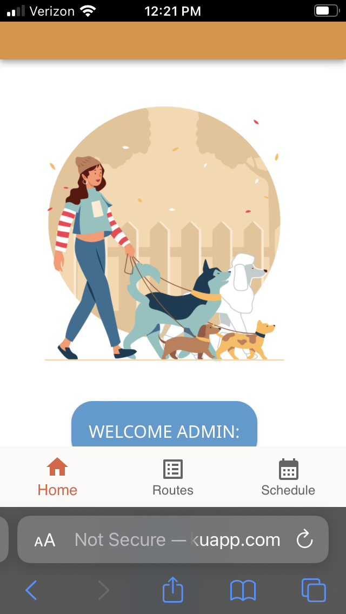
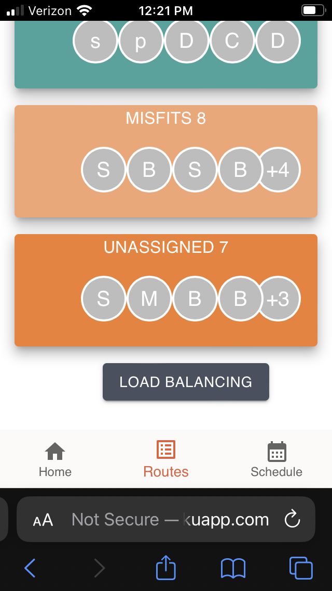
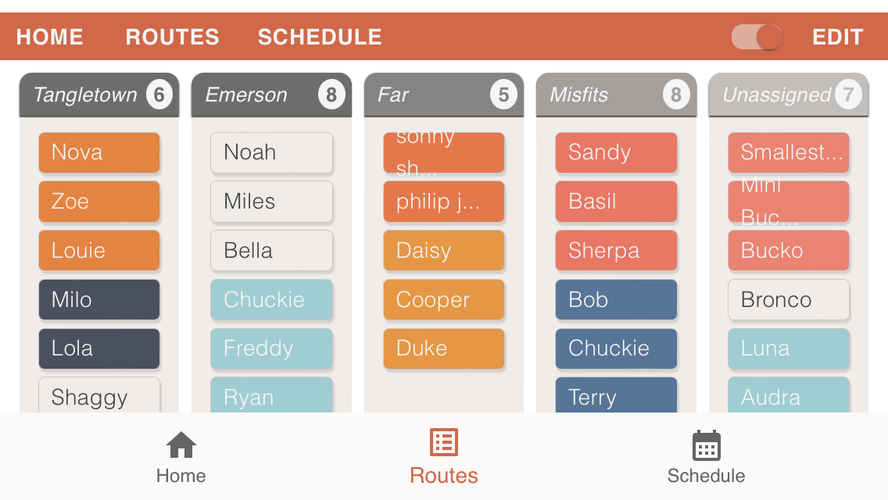
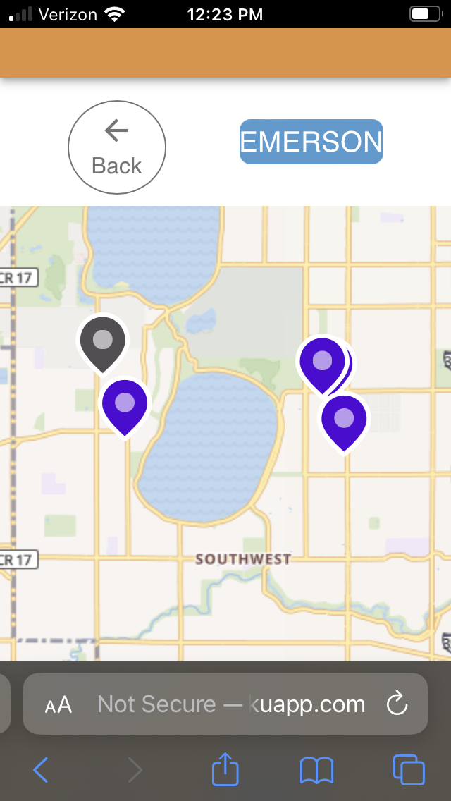
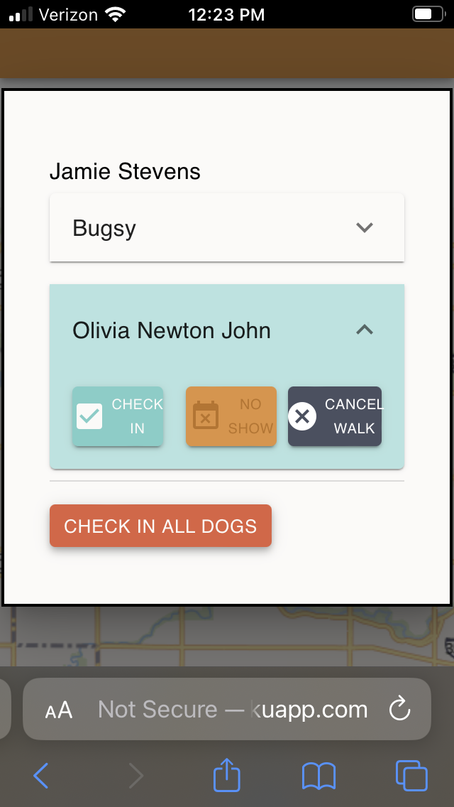

# Citizen Kanine
  
## Summary

[Citizen Kanine](https://thecitizenkanine.com/) is a dog-walking business based in Minneapolis. Each morning, 'Pack Leaders' pick up clients' dogs in along designated routes vans. On a typical day, the business walks 36+ dogs in small groups around Lake Harriet.
 
This custom React web-application integrates the company's scheduling, invoicing, record-keeping, and communications functions. The app contains two separate workflows: an admin dashboard and a mobile view for employees. The admin portal provides a centralized location for our client to manage employee schedules, client information and scheduling and invoicing. The mobile view allows employees to manage the distribution of dogs along pick-up routes on a daily basis, as well efficiently checking in which dogs were walked each day.

Key Features:

- Employees utilize a 'drag and drop' mobile interface to balance the daily load of dogs
- Employees see the client location in a maps view, allowing single-screen navigation and dog check-ins.
- App syncs client data with Citizen Kanine's Quickbooks account via the Quickbooks API
- App creates formatted Quickbook invoices at the click of a button
- Admin can view client history and submit changes to client schedules


Citizen Kanine currently relies on the production app for its daily operations. Its completed version was developed by myself ([Dan Raskin](https://github.com/danraskin)) and [Sam Freeman](https://github.com/sam-c-freeman). I am continuing to develop its features in collaboration with the company and its employees. The original prototype was built in a three-week sprint with a team of four other developers: [Sarah Preston](https://github.com/seprest1), [Blake Smith](https://github.com/blakesmithmn), [Yanira Hagstrom](https://github.com/YaniraHagstrom) and [Sam Freeman](https://github.com/sam-c-freeman) as a part of [Prime Digital Academy](www.primeacademy.io)

### How to check out the Citizen Kanine App
[Click here](http://citizen-kanine-demo.herokuapp.com) to interact with a fully functional demo version of the Citizen Kanine App. 

You will be prompted for authorization. submit the following:

>username: admin
>
>password: admin

#### MOBILE VIEW

The mobile views can be accessed your via your desktop by changing the screen size in your browser's Developer Tools, but it is designed be viewed on a mobile device! Logging in as admin will take you the mobile home view:



Select 'Routes,' scroll to the bottom, and select 'load balancing.'



Turn the screen sideways as prompted to view the load balancing screen. Select the "edit" button on the top-right and explore the drag and drop function!



Return the the "Routes" screen via the bottom nav-bar, and navigate to a route of your choice. Select the 'Map' button.



Select an icon to open up the 'check-in' modal. This is how pack leaders check in dogs. (They can also do this in the previous 'Route view').



Each dog must be identified as 'checked-in', 'no-show', or 'cancelled' individually. After checking in all dogs, click 'check-in all dogs.' This does not affect dog check-in in status, but it does change the icon color so that pack leaders can keep track of their pick-ups!

#### ADMIN DASHBOARD

Logging in as admin will take to the admin dashboard.

## Approach:

With this project being a much larger workload than previous projects in our experience, and the added layer of Client involvement planning was integral to results. Before starting development we spent a week scoping the project, connecting with the client to clarify their needs,  and setting up a timeline. 

##### Wireframe / User Flow Prototype:
  
Through the sprint, our team met with the Client on multiple occasions to provide updates, and clarify questions. In order to remain on schedule, our group utilized a Kanban board to visualize tasks that were in-progress, completed, or blocked. This helped clarify which pieces of the puzzle still needed completion, and streamlined the team's workflow.

)

As a representation of the planning spent on this project - we have included the scope document. This process involved spending time considering user flow, component structure, and design potential for the application. This experience also involved setting a timeline for certain features and was an interesting venture into estimating development time for a small team of developers.

[Scope Document with Wireframes](https://docs.google.com/document/d/1_sO_B9sY84xYKGdlWtzBYzdPIXpx9b63RNzQ3Ie6izc/)

  

If you would like to see a draft of the database structure created during scoping - we have included the relevant ERD. This shows how the tables interact with one another and gives context to functions within the program.

  

[Entity-Relationship Diagram](https://app.dbdesigner.net/designer/schema/563565)

  

  

## Getting Started:

  

  

### Prerequisites

  

- React.js *(built on version 17.0.2)*

  

- Keys for Cloudinary & PidgeonMaps API's

  

- DotEnv file 


-  [Node.js](https://nodejs.org/en/)

  

- Axios

  

- Redux

  

- Redux-Saga

  

- [Material.UI](https://mui.com)

  

- Express

  

- Body-Parser

  

- 'PG'

  

- Database Manager

  

  

### Installation
Using your package manager - install the dependencies

```
$ ~ npm install
```
In your database manager - create a database named `citizen_kanine` use the provided database.sql file to create the necessary tables for this project. 
*(We have included optional dummy data for testing purposes)*

Populate dotEnv file with:

> SERVER_SESSION_SECRET= 'string'
> map_api_key= 'string'
> CLOUDINARY_NAME= 'string'
> CLOUDINARY_API_KEY= 'string'
> CLOUDINARY_API_SECRET= 'string'

With your database set up - start the server.
```
$ ~ npm run server
```

With the server running - open another terminal window and start your client.

Navigate to http://localhost:3000 if the run client script doesn't automatically open the application.

```
$ ~ npm run client
```

Since the app is not client facing at this time - there is no registration page. You will have to add an account through a `SQL INSERT` in your database manager.

## Built With:

*  [React.js](https://reactjs.org/docs/getting-started.html)
*  [Node.js](https://nodejs.org/en/docs/)
* [Material-UI](https://mui.com) - components and styling
* [React-beautiful-dnd](https://github.com/atlassian/react-beautiful-dnd) - Drag and Drop functionality for mobile view
* [Day.js](https://day.js.org) - Time Utility
* [SweetAlert](https://sweetalert.js.org) - Visual feedback for users
* [Passport](https://www.passportjs.org) - Secure Login & Account Management

*For a full list of dependencies - see the Package.json*

## Screen Shots

  

## Usage

  This application is meant to serve as a business management tool for Citizen Canine. It is meant to handle client, and employee scheduling - as well as client invoicing.  The next sections will walk you through the tools at your disposal in each view. 

### Desktop *(Admin Dashboard)*

 1. **Log In** - when logging in on a desktop using admin level credentials users will be brought to a desktop 'Splash Page'
 2. **Splash Page** - a Home Screen for the desktop experience, contains a notes section to help keep admin organized. Also includes a collapsible sidebar which allows for convenient site navigation.
 3. **Employee Management 'Pack Leaders'** - enter this view through the sidebar -  in this view admin is able to add/edit/delete employees, as well as modify and view their schedules.  Adding an employee will generate an account with their email as the username, and a temporary password.
 4. **Clients** -  enter this view through the sidebar - in this view admin can add/edit/delete clients as well as their dogs. There is also a search function to help access a specific client quickly. Also allows for schedule viewing and editing. 
 5. **Reports** -  enter this view through the sidebar - an invoicing tool for admins to select relevant data and export a CSV file to import into Quickbooks.
 6. **Account** - a form for admin to change their password.

### Mobile *(Employee View)*

 1. **Log In** - employees and admins can log in on a mobile device to access the mobile features. 
 2. **Splash Page** -  quick navigation page for relevant tools, as well as a bottom navigation bar to access these tools.

**Dogs in this section may contain 'flags' which tell the employee there may be a relevant note about the dog and its behavior.**

 3. **Routes / Route Select** - accessing routes through the provided navigation tools will lead users to a view showing the assigned dogs for a given day, and their default route distribution. **Admin** level users will have a button to access load balancing. Once routes are set for the day - users simply click their assigned route to view the details. 
 4. **Load Balancing** -  a tool for Admin level users to distribute dogs amongst their daily employees using a drag and drop interface. If a household has multiple dogs - they are grouped and have a matching background color. (Section contains flags)
 5. **Route Screen** -  once routes are set, and a user selects their assigned route on the route select page and is brought to a list view with tools for route management. Clicking on a line in the list of dogs will reveal the options available for a user. Here employees are able to mark a dog as 'checked in' or a 'no show', which will in turn update their list visually marking said dog off of the list. In this view, Admin level users are able to cancel a dog at no charge - in case they were accidentally still on the schedule for a given day. Clicking on a dog photo or avatar on the left side of the list will bring a user to Dog Details. (Section contains flags)
 6. **Dog Details** - this view shows relevant information for a specific dog and their client. Here is a centralized location for access protocols for client homes, notes on dog needs, emergency contact information, as well as photo upload for dog identification. (Section contains flags)
 7. **Account** - a form for users to change their password.

## Authors & Acknowledgement

Thanks to [Cloudinary](https://cloudinary.com) whose API supplied image upload capabilities for multiple parts of this application.

Thanks to [Prime Digital Academy](www.primeacademy.io) who equipped and helped us make this application a reality.

Special thanks to the services that made the start of our Map display development possible:

 - [Radar](https://radar.com) - for Geo Coding
 - [MapTiler](https://www.maptiler.com) 
 - [Pigeon Maps](https://pigeon-maps.js.org) - React Maps

  
test
  
